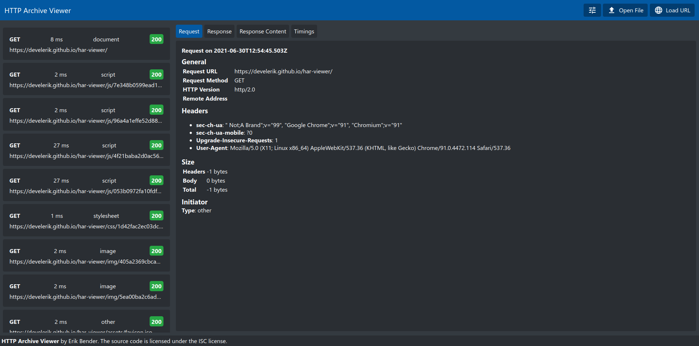

  

<h3 align="center">HAR Viewer</h3>

  

    Simple viewer for HTTP Archives
     
    <a href="https://github.com/develerik/har-viewer"><strong>Explore the docs »</strong></a>
     
     
    <a href="https://develerik.github.io/har-viewer">View Demo</a>
    ·
    <a href="https://github.com/develerik/har-viewer/issues/new/choose">Report Bug</a>
    ·
    <a href="https://github.com/develerik/har-viewer/issues/new/choose">Request Feature</a>
  

## About The Project

  

 

**HAR Viewer** is an easy to use viewer for HTTP Archive files. All processing is done locally on your device.

The following features are supported:

- Loading `.har` files from file or url
- Filter entries on Method, Status Code, Domain and Resource Type
- Sort entries by Status Code and Timing
- Group entries by Method, Status Code, Status Type, Domain and Resource Type
- Offline usage (PWA)
- Usable UI on mobile devices

## Usage

1. Visit [https://develerik.github.io/har-viewer](https://develerik.github.io/har-viewer)
2. Open a `.har` file
  - Option 1: Open a file from your local device
  - Option 2: Open a file from a remote url
3. Analyze your file

## Roadmap

- Export Feature (filters, redact, postman)
- Support initial filter on file load to improve loading times for large files
- Settings dialog

See the [open issues](https://github.com/develerik/har-viewer/issues) for a list of proposed features
(and known issues).

## Get Support

This project is maintained by [@develerik](https://github.com/develerik). Please understand that we won't be able to
provide individual support via email. We also believe that help is much more valuable if it's shared publicly, so that
more people can benefit from it.

- [**Report a bug**](https://github.com/develerik/har-viewer/issues/new?labels=bug&template=bug_report.md)
- [**Requests a new
  feature**](https://github.com/develerik/har-viewer/issues/new?labels=enhancement&template=feature_request.md)
- [**Report a security
  vulnerability**](https://github.com/develerik/har-viewer/issues/new?labels=vulnerability&template=vulnerability_report.md)

## Contributing

Contributions are what make the open source community such an amazing place to be learn, inspire, and create. Any
contributions you make are **greatly appreciated**.

1. Fork the Project
2. Create your Feature Branch (`git checkout -b feature/AmazingFeature`)
3. Commit your Changes (`git commit -m 'Add some AmazingFeature'`)
4. Push to the Branch (`git push origin feature/AmazingFeature`)
5. Open a Pull Request

Please read [CONTRIBUTING.md](CONTRIBUTING.md) for details on our code of conduct.

## Maintainers

- **Erik Bender** - *Initial work* - [develerik](https://github.com/develerik)

See also the list of [contributors](https://github.com/develerik/har-viewer/graphs/contributors) who participated in
this project.

## License

Distributed under the ISC License. See [LICENSE](LICENSE) for more information.
